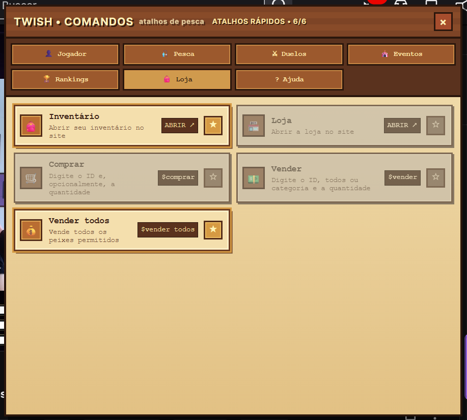
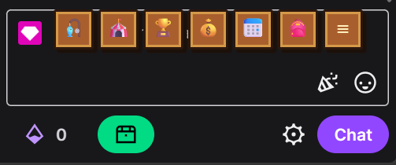

# 🎣 Twish Comandos

Extensão para **Chrome e Microsoft Edge** que facilita o uso dos comandos do Twish diretamente no chat da Twitch.

O **Twish Comandos** adiciona uma barra de atalhos ao chat e um menu flutuante com os comandos organizados por categoria, evitando que você precise decorar ou digitar cada comando manualmente.

> Versão atual: **v3.1.0**

## ✨ Principais recursos

- 🎣 Comandos do Twish organizados por categoria
- ⭐ Até **6 atalhos rápidos personalizáveis**
- 💾 Atalhos salvos automaticamente no navegador
- 🕹️ Interface pixel-art integrada à Twitch
- 🔗 Acesso direto a páginas como Inventário, Loja e Comandos
- 💬 Preenchimento dos comandos diretamente no chat
- 🔒 Sem envio automático de mensagens

## 📸 Preview

Os screenshots da extensão serão adicionados na pasta `assets/`.

<!--
Quando os arquivos forem adicionados, use:

-->

## 🎮 Menu de comandos

Clique no botão `≡` ao lado da barra de atalhos para abrir o menu flutuante.

Os comandos são separados em categorias como:

- 👤 Jogador
- 🎣 Pesca
- ⚔️ Duelos
- 🎉 Eventos
- 🏆 Rankings
- 🛍️ Loja
- ❓ Ajuda

Ao clicar em um comando de chat, a extensão preenche o campo de mensagem da Twitch. **A mensagem não é enviada automaticamente**: o usuário continua responsável por pressionar Enter.

## ⭐ Barra de atalhos personalizável

Você pode escolher até **6 comandos** para deixar disponíveis diretamente na barra rápida.

No menu flutuante:

- `☆` — comando fora da barra rápida
- `★` — comando selecionado
- Cards selecionados ficam visualmente destacados
- O contador mostra quantos espaços estão sendo utilizados (`X/6`)

As preferências são armazenadas localmente no navegador e permanecem disponíveis após atualizar ou fechar a Twitch.

O botão `≡` fica sempre disponível e não ocupa um dos seis espaços personalizáveis.

## 🔗 Acesso direto ao Twish

Alguns recursos que correspondem a páginas do Twish podem ser abertos diretamente em uma nova aba, incluindo:

- 🎒 Inventário
- 🛍️ Loja
- ⌨️ Comandos

## 📦 Instalação

### Chrome

1. Baixe este repositório usando **Code → Download ZIP**.
2. Extraia o arquivo ZIP.
3. Abra `chrome://extensions/`.
4. Ative o **Modo do desenvolvedor**.
5. Clique em **Carregar sem compactação**.
6. Selecione a pasta extraída que contém `manifest.json`.
7. Abra ou atualize uma página da Twitch.

### Microsoft Edge

1. Baixe este repositório usando **Code → Download ZIP**.
2. Extraia o arquivo ZIP.
3. Abra `edge://extensions/`.
4. Ative o **Modo de desenvolvedor**.
5. Clique em **Carregar sem compactação**.
6. Selecione a pasta extraída que contém `manifest.json`.
7. Abra ou atualize uma página da Twitch.

## 🚀 Como usar

Depois da instalação, abra um canal da Twitch que utilize o Twish.

A barra de atalhos aparecerá próxima ao campo de mensagens. Use os atalhos para acessar seus comandos favoritos ou clique em `≡` para abrir o menu completo.

## 🔒 Privacidade e automação

A extensão funciona localmente no navegador e armazena as preferências dos atalhos localmente.

O projeto **não envia mensagens automaticamente** e não foi desenvolvido para automatizar pesca, contornar cooldowns ou executar comandos repetidamente.

## 🛠️ Tecnologias

- JavaScript
- HTML/CSS gerados pela extensão
- Chrome Extensions — Manifest V3
- Web Storage para preferências locais

Não é necessário servidor nem instalação de dependências para utilizar a extensão.

## 🤝 Contribuições

Sugestões, melhorias e correções são bem-vindas.

Caso encontre algum problema, abra uma **Issue** descrevendo o comportamento e, se possível, inclua uma captura de tela.

Pull Requests também são bem-vindos.

## ⚠️ Aviso

Este é um projeto independente criado para facilitar o acesso aos comandos do Twish na Twitch.

O projeto não é afiliado, patrocinado ou oficialmente mantido pela Twitch ou pelo Twish. **Twitch**, **Twish** e demais marcas mencionadas pertencem aos seus respectivos proprietários.

## 📄 Licença

Ainda não foi definida uma licença para o projeto. Antes de reutilizar, modificar ou redistribuir o código, consulte os termos definidos pelo autor do repositório.
